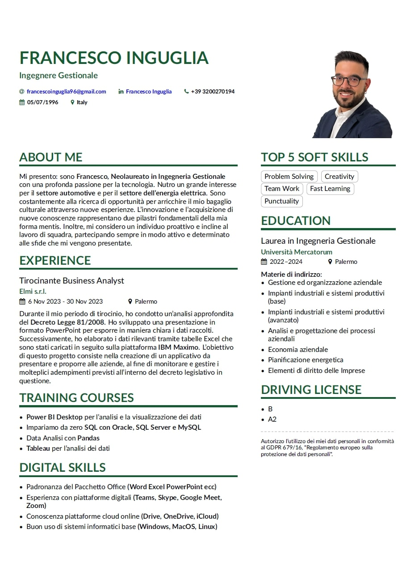

# AltaCV - CV in LaTeX a Singola Pagina 

v1.2 (23 Gennaio 2024) di Francesco Inguglia


## Introduzione

Questo repository è pensato per te, amante di LaTeX, per darti un'idea interessante per un curriculum vitae.
Puoi utilizzare questo modello per creare in pochi minuti il tuo curriculum personale.

Di seguito troverai una selezione di passi da seguire per personalizzare il tuo curriculum, divertiti.

Puoi trovarmi anche su:

[](https://www.linkedin.com/in/francesco-inguglia/)
[](https://www.instagram.com/fraa9696/)


## Aspetto del Curriculum


## Editor
Nel caso tu non conosca LaTeX, non preoccuparti, puoi utilizzare [Overleaf](https://overleaf.com), un editor online gratuito e fantastico,
basta creare un account, avviare un nuovo progetto e caricare i file di questo repository.

Per avere i file sul tuo PC, clona semplicemente questo repository:

1) Seleziona la posizione in cui desideri memorizzare il file nel tuo terminale

   ```bash
   cd Progetti/curriculum
   ```

2) Clona il repository

   ```bash
   git clone https://github.com/EmanueleSeminara/LaTeX_resume.git
   ```

Dopo aver caricato i file, dovrai solo modificare il contenuto dei file per scrivere ciò che desideri nel tuo curriculum.
È davvero intuitivo, nel caso tu abbia bisogno di ulteriori informazioni su cosa modificare, puoi consultare le sezioni seguenti.

## Requisiti e Compilazione

* Alla riga 76 di main.tex puoi inserire le tue informazioni personali.
* page1sidebar.tex contiene il codice per la parte destra del curriculum.
* Ricorda di sostituire l'immagine con la tua foto e utilizza un formato png.
* Se desideri cambiare i colori, vai alla riga 48 di main.tex.
* AltaCV utilizza [`fontawesome`](http://www.ctan.org/pkg/fontawesome) e [`academicons`](http://www.ctan.org/pkg/academicons); sono inclusi sia in TeX Live 2016 che in MikTeX 2.9.
* Il caricamento di `academicons` è facoltativo: attivalo aggiungendo l'opzione `academicons` a `\documentclass`.
* Ora può essere compilato con pdflatex, XeLaTeX e LuaLaTeX!
* Tuttavia, se stai utilizzando `academicons`, _devi_ usare XeLaTeX o LuaLaTeX. Se il documento viene compilato ma le icone non appaiono nel PDF finale, prova a compilare con LuaLaTeX invece.
* Negli esempi qui mostrati viene utilizzato il carattere [Lato](http://www.latofonts.com/lato-free-fonts/).
